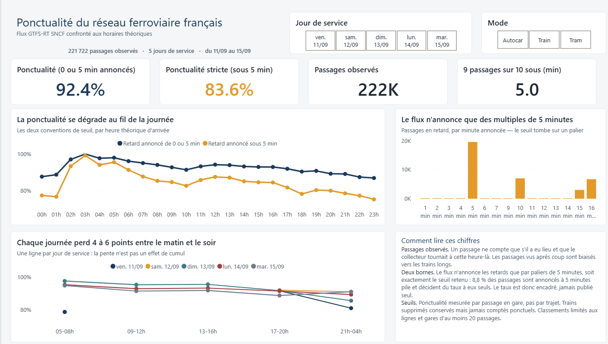
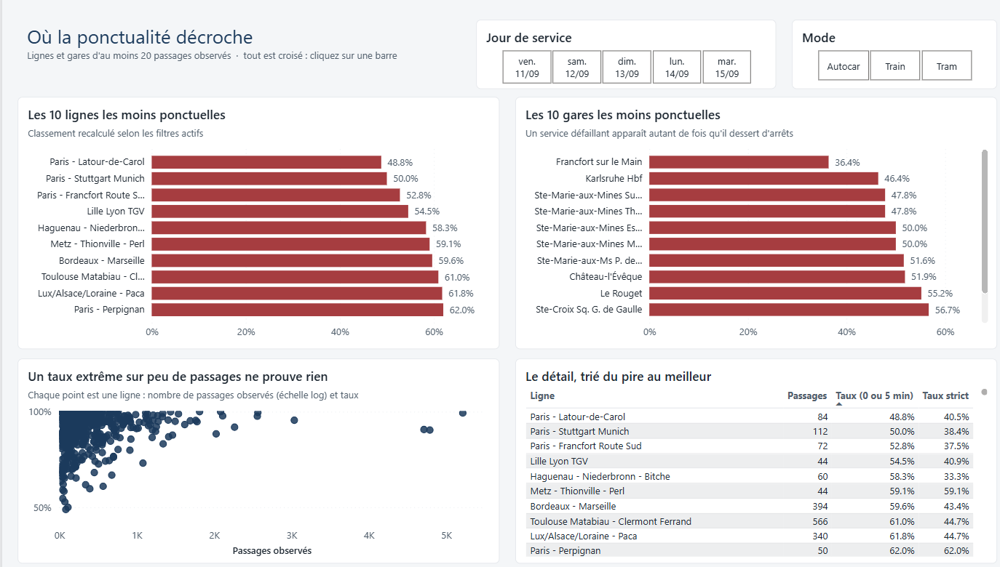
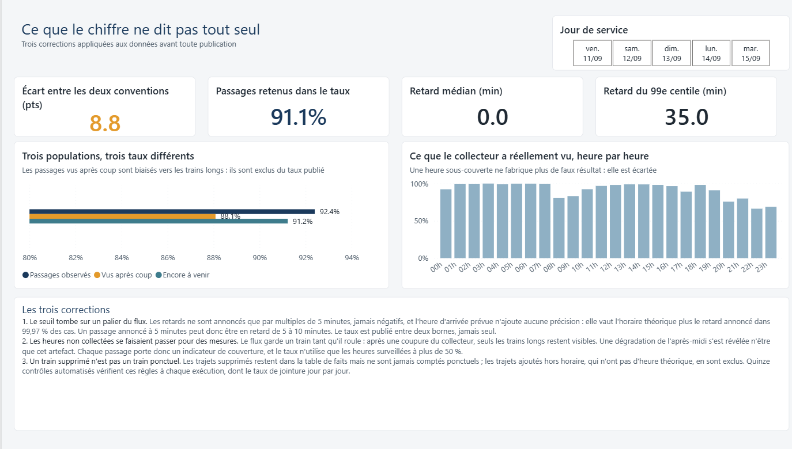

# Ponctualité ferroviaire — pipeline temps réel GTFS-RT

Pipeline de collecte et d'analyse de la ponctualité du réseau ferroviaire
français (TGV, Intercités, TER), à partir des données ouvertes du Point d'Accès
National [transport.data.gouv.fr](https://transport.data.gouv.fr).

**Objectif :** mesurer la ponctualité réelle en confrontant les passages temps
réel (GTFS-RT) aux horaires théoriques (GTFS), et restituer les résultats par
ligne, par gare et par tranche horaire — avec un focus Grand Est
(Mulhouse – Strasbourg – Bâle).

## Le rapport

Trois pages, construites sur les seuls passages observés. Les segments
« Jour de service » et « Mode » sont synchronisés d'une page à l'autre, et tous
les visuels se croisent : cliquer sur une ligne filtre le reste de la page.



La première page met le taux entre ses deux bornes et donne, juste à côté, la
raison de cet encadrement : le flux n'annonce les retards que par paliers de
5 minutes. La courbe horaire est doublée d'une lecture jour par jour, parce
qu'une courbe cumulée avait déjà menti une fois (journal du 12/09).



Les classements se recalculent à chaque filtre : le top 10 est une mesure de
rang en DAX, pas un filtre figé. Le nuage de points rappelle ce que les
classements ne disent pas — un taux extrême sur 20 passages ne pèse pas autant
qu'un taux médiocre sur 500.



La troisième page expose les corrections appliquées avant publication, et ce que
chacune a changé. C'est elle qui sépare une mesure d'une impression.

## Sources

| Source | Format | Contenu |
|---|---|---|
| [Horaires théoriques SNCF](https://transport.data.gouv.fr/datasets/horaires-sncf) | GTFS | Versions quotidiennes archivées et appliquées successivement (fenêtre glissante, voir journal du 12/09) |
| [SNCF GTFS-RT Trip Updates](https://proxy.transport.data.gouv.fr/resource/sncf-gtfs-rt-trip-updates) | GTFS-RT | ~2 240 trajets et ~20 300 prévisions d'arrêt par appel |

Les données sont diffusées sous Licence Ouverte (Etalab) par le Point d'Accès
National ; elles ne relèvent pas de la licence MIT, qui couvre le code.

## Qualité des données — ce qui a été mesuré

Taux de jointure entre le flux temps réel et le référentiel théorique
(`src/reconcile_check.py`, mesure du 11/09/2026) :

| Jointure | Taux |
|---|---|
| `trip_id` (hors trajets non planifiés) | **99,85 %** (2 015 / 2 018) |
| `stop_id` | **100 %** (20 279 / 20 279) |

Ce taux est recalculé **par jour de service** à chaque exécution du contrôle
qualité (`src/quality_checks.py`), jamais en cumulé, avec un seuil d'échec à
95 % : du 11 au 15/09, 99,85 %, 99,91 %, 99,87 %, 99,71 % et 97,95 %.

Répartition des trajets du flux temps réel :

| `schedule_relationship` | Présent dans le GTFS | Nombre |
|---|---|---|
| `SCHEDULED` | oui | 1 991 |
| `CANCELED` | oui | 24 |
| `CANCELED` | non | 3 |
| `ADDED` | non | 220 |

Les 220 trajets absents du référentiel sont explicitement marqués `ADDED` :
la spécification GTFS-RT les définit comme des trajets ajoutés hors horaire
planifié. Les compter comme des échecs de jointure ramènerait le taux à 90 %
et donnerait une image fausse de la qualité du flux. Ils sont donc exclus du
calcul et traités à part : n'ayant pas d'horaire théorique, ils ne peuvent pas
faire l'objet d'un calcul de retard.

## Journal de bord

Les problèmes rencontrés sur les données sont documentés ici plutôt que masqués :
ils font partie du travail.

### 2026-09-10 → 09-11 — Le flux temps réel Soléa est vide : abandon de la source

Le projet visait initialement le réseau urbain Soléa (Mulhouse). Première
interrogation du flux trip updates à 22:47 : réponse HTTP 200, mais **13 octets**.
Décodage manuel du protobuf :

```
0a0b 0a03 312e 3018 baae 8cd5 06
└─ header (11 octets) : gtfs_realtime_version="1.0", timestamp=1789073210
   aucune entité
```

L'hypothèse d'un flux simplement vide en dehors des heures de service a été
testée par une collecte automatisée toutes les 2 minutes :

- **110 appels sur 20 heures**, dont 22 en heures de service (vendredi 13h–15h et 18h)
- **charge utile identique à l'octet près à chaque appel** : 13 octets, zéro entité
- groupe de contrôle : sur le même collecteur, le flux *service alerts* a varié
  entre 5, 6 et 7 alertes — la collecte fonctionnait bien

Conclusion : le flux trip updates de Soléa est publié mais ne contient aucune
donnée. Le calcul de ponctualité y est impossible. *Limite de la mesure :* le
poste étant en veille la nuit, la pointe du matin (7h–9h) n'a pas été
échantillonnée ; la constance de la charge utile jour et nuit rend toutefois
l'hypothèse d'un flux alimenté uniquement le matin peu crédible.

**Décision : bascule vers le flux SNCF**, vérifié avant toute reconstruction
(`src/probe_feeds.py`) :

| Flux | Entités | Prévisions d'arrêt | Dont avec retard | Taille |
|---|---|---|---|---|
| SNCF | 2 247 | 20 379 | 18 116 (89 %) | 1,58 Mo |
| Soléa | 0 | 0 | 0 | 13 o |

### 2026-09-11 — Les identifiants non appariés ne sont pas des troncatures

Premier constat : 90 % seulement des `trip_id` temps réel se retrouvaient dans
le GTFS. Les identifiants non appariés (`OCESN117153F`) ressemblant à des
versions tronquées des identifiants théoriques
(`OCESN105241F1187_F:NAV:FR:Line::…`), l'hypothèse d'une réconciliation par
préfixe a été testée — **et invalidée** : 3 cas résolus sur 223.

L'examen du champ `schedule_relationship` a donné la vraie explication : 220 des
223 trajets concernés sont marqués `ADDED`, donc absents du référentiel par
construction. Le taux de jointure pertinent est de 99,85 %, pas de 90 %.

### 2026-09-11 — Pas d'archivage des payloads bruts

Le flux SNCF pèse 1,58 Mo par appel, soit environ **0,8 Go par jour** de service
à raison d'un appel toutes les 2 minutes. L'archivage brut pratiqué sur Soléa
(13 octets par appel) n'est pas transposable.

Choix retenu : décodage à l'ingestion et stockage des seules observations utiles,
avec mise à jour de la dernière valeur connue par couple (trajet, arrêt) et par
date de service. Le volume passe de ~0,8 Go/jour à quelques dizaines de milliers
de lignes par jour, et la dernière valeur observée avant le passage effectif
constitue le meilleur estimateur du retard réalisé.

### 2026-09-11 — `stop_sequence` n'est pas alimenté par le flux SNCF

Sur les 20 284 prévisions d'arrêt d'un appel, le champ `stop_sequence` vaut `0`
partout. Les lignes restent uniques grâce au `stop_id`, mais **l'ordre des
arrêts le long d'un trajet ne peut pas être déduit du flux temps réel** : il
devra être repris de `stop_times.txt` du GTFS théorique. Le champ est conservé
dans la clé primaire au cas où la SNCF l'alimenterait par la suite.

### 2026-09-11 — Première mesure

Sur un instantané de 18 031 arrivées observées :

| Écart à l'horaire | Part |
|---|---|
| À l'heure ou en avance | 85,6 % |
| Retard ≤ 5 min | 8,3 % |
| 5 – 15 min | 3,3 % |
| 15 – 30 min | 1,6 % |
| > 30 min | 1,1 % |

**Ponctualité (arrivée à moins de 5 minutes) : 94,0 %.** Retard maximal
observé : 160 minutes. Chiffre provisoire — il porte sur un instantané et non
sur une journée complète consolidée.

### 2026-09-11 — Passages effectués et passages à venir : une hypothèse invalidée

Entre deux exports séparés d'une heure, la ponctualité globale est passée de
93,1 % à 91,2 %, la tranche 20h chutant de 97,3 % à 92,4 % alors que la tranche
18h ne bougeait presque pas. Hypothèse formulée : le flux temps réel étant
consulté avant l'heure de passage, les tranches encore à venir portaient des
prévisions optimistes, corrigées à mesure que les trains passaient réellement.

**Vérification — hypothèse fausse.** En comparant les deux populations
(`arrival_time` et `observed_at` étant deux horodatages absolus, la comparaison
ne demande aucun calcul de fuseau) :

| Population | Effectif | Ponctualité | Retard moyen |
|---|---|---|---|
| Passage déjà effectué | 12 901 | **91,9 %** | 2,2 min |
| Passage encore à venir | 8 286 | **90,0 %** | 2,7 min |

Les prévisions sont donc légèrement **plus pessimistes** que les réalisations,
et non l'inverse. La baisse du taux global s'explique plus simplement : l'export
suivant portait sur 3 000 passages supplémentaires, couvrant des trajets de
soirée plus tardifs.

La distinction reste néanmoins pertinente et a été conservée sous la forme d'un
indicateur `is_past` dans la table de faits : un taux qui mélange des passages
effectués et des passages à venir mesure en partie des prévisions et non des
résultats, et les deux populations diffèrent de façon mesurable.

### 2026-09-12 — Le référentiel est une fenêtre glissante : une correction qui a aggravé les choses

Le taux de jointure global est passé de 99,84 % à 99,16 %. Diagnostic posé : GTFS
théorique périmé — la copie locale datait du 11, la SNCF en avait publié une
nouvelle le 12. Correction appliquée : télécharger l'export récent et remplacer
l'ancien.

**Résultat, mesuré jour par jour :**

| Jour | GTFS du 11 | Après remplacement |
|---|---|---|
| vendredi 11 | 99,85 % | **94,45 %** |
| samedi 12 | 98,38 % | 98,33 % |

La correction a cassé vendredi sans réparer samedi. Deux erreurs :

- **L'export SNCF est une fenêtre glissante.** Chaque version démarre à sa date de
  publication (`feed_start_date` 20260912) et abandonne les trajets antérieurs.
  Remplacer la copie a donc orphelinisé les observations de la veille — et le
  remplacement atomique avait supprimé l'ancienne version.
- **Le contrôle qualité mesurait un taux agrégé.** À 96,28 %, il passait le seuil
  de 95 % : une journée à 94 % se cachait derrière une journée saine.

**Correction réelle.** Les versions précédentes étaient récupérables dans
l'historique de transport.data.gouv.fr (les 25 dernières y sont archivées).
Trois ont été récupérées et validées. Le référentiel est désormais **historisé** :

- `download_gtfs.py` archive chaque publication sous son horodatage dans
  `data/gtfs/versions/` et n'écrase jamais rien ;
- `load_gtfs.py` applique les versions dans l'ordre de `feed_version`. Un trajet
  présent dans une version récente en reprend entièrement la définition (sa
  séquence d'arrêts est remplacée, pas fusionnée) ; un trajet absent des versions
  récentes est conservé, puisque des observations y renvoient encore. Le
  chargement est incrémental ;
- `quality_checks.py` contrôle le taux de jointure **par jour de service**.

| Jour | Après historisation |
|---|---|
| vendredi 11 | **99,85 %** |
| samedi 12 | **99,92 %** |

Samedi dépasse même son niveau initial : les trajets qui manquaient figuraient
dans la version du 11, absente de l'export du 12. Seule l'accumulation des
versions pouvait les retrouver.

### 2026-09-12 — Les heures non collectées se faisaient passer pour des mesures

Le collecteur tourne sur un poste personnel et s'arrête avec lui. Sur ses 27
premières heures, il a été **à l'arrêt 62 % du temps** (vendredi 20:02 → 23:57,
samedi 08:07 → 20:26).

Ces trous ne se voyaient pas comme des trous. Le flux conserve les arrêts déjà
desservis d'un trajet tant que le train roule : à la reprise de la collecte, des
passages de l'après-midi restent visibles — mais seulement ceux des trains
**encore en circulation**, donc les plus longs. Vendredi, collecte démarrée à
18:50 :

| Heure | Passages effectués | Durée moyenne du trajet | Trajets > 3 h | Ponctualité apparente |
|---|---|---|---|---|
| 14h | 45 | 378 min | 100 % | 75,6 % |
| 16h | 303 | 233 min | 61 % | 88,8 % |
| 18h | 6 167 | 94 min | 7 % | 90,4 % |
| 19h | 5 545 | 94 min | 8 % | 92,8 % |

La « dégradation de fin d'après-midi » affichée dans les premières versions de
ce document était un **biais de survie** : elle décrivait les trains longs, pas
le réseau à 14h. Même mécanisme à 21h, après l'arrêt de la collecte.

**Correction :**

- `dim_collection_hour` enregistre, pour chaque heure de chaque jour, la part de
  l'heure pendant laquelle le collecteur tournait. Heure de Paris via `tzdata`,
  donc juste aux changements d'heure ; une heure manquée est un zéro explicite,
  pas une ligne absente.
- `fact_passage.is_collected` marque les passages survenus pendant une heure
  surveillée (au moins 50 %), jugée **jour par jour**, jamais en moyenne sur
  plusieurs jours. Un horaire GTFS au-delà de 24:00 est rattaché au jour civil
  suivant.
- **Tous les taux** — global, horaire, classements — portent désormais sur les
  passages *observés* : `is_past = 1` et `is_collected = 1`. Une seule
  définition, appliquée à l'identique par `report.py` et par la mesure Power BI
  `Taux ponctualite observe`.

Le biais se chiffre : **88,5 %** de ponctualité sur les passages vus après coup,
contre **92,6 %** sur les passages observés. Et il ne touchait pas que la courbe
horaire : `Francfort – Marseille`, en tête des pires lignes avec 36 passages,
n'en compte que 3 réellement observés — trop peu pour être classée.

Recouper les classements SQL et Power BI a révélé deux autres écarts, corrigés
côté SQL :

- la SNCF découpe certaines lignes en plusieurs `route_id`. Classer les fragments
  séparément faisait passer sous le seuil de 20 passages un fragment en retard,
  qui disparaissait du classement : `32. Ussel – Brive – Périgueux – Bordeaux`
  affichait 60,0 % sur son fragment principal pour 53,9 % sur la ligne entière ;
- certains noms existent en deux casses (`STRASBOURG – NIEDERBRONN…` et
  `Strasbourg – Niederbronn…`). Power BI regroupe le texte sans tenir compte de
  la casse, SQLite si.

Les dix premières lignes et les dix premières gares sont désormais identiques
dans les deux outils.

### 2026-09-13 — Sortir la collecte du poste personnel

La collecte sur poste personnel avait été à l'arrêt 62 % du temps. Elle tourne
désormais dans Supabase (offre gratuite) : une Edge Function appelée toutes les
5 minutes par `pg_cron`. Seule la collecte y est hébergée ; le référentiel GTFS,
le schéma en étoile et les contrôles restent sur le poste, qui rapatrie les
données (`src/sync_supabase.py`).

**Contraintes de l'offre gratuite, vérifiées avant de construire :** 2 s de CPU
par exécution, 256 Mo de mémoire, base de 500 Mo, mise en pause après 7 jours
sans activité (une collecte toutes les 5 minutes l'exclut). Première exécution
planifiée : **624 ms** au total, téléchargement et écriture compris.

**Le stockage imposait une rétention.** Mesure réelle : 526 octets par ligne,
l'identifiant de trajet SNCF (~100 caractères) étant stocké dans la table puis
dans l'index de clé primaire. Le GTFS théorique prévoit ~98 000 passages en
semaine : ~49 Mo/jour, soit 500 Mo atteints en une dizaine de jours — après quoi
Supabase restreint le projet et la collecte s'arrête. Supabase garde donc
7 jours ; l'archive est la base locale.

**Chaque exécution réécrivait toute la table.** La règle d'origine (« une lecture
plus récente remplace la ligne ») réécrit à chaque passage toutes les lignes
encore présentes dans le flux, presque toujours à l'identique. Sans conséquence
en SQLite, mais en Postgres chaque réécriture laisse une version morte et de
nouvelles entrées d'index. Nouvelle règle, identique pour les deux collecteurs :
une ligne n'est réécrite que si une valeur change — ou une seule fois quand la
lecture confirme que le train est passé, faute de quoi `is_past` resterait faux.

| Exécution | Règle | Arrêts reçus | Lignes écrites |
|---|---|---|---|
| 19:05 | tout réécrire | 7 532 | 7 532 (100 %) |
| 19:10 | changements seulement | 7 430 | **344 (4,6 %)** |

La règle a été testée sur huit cas (valeurs inchangées, lecture plus ancienne,
`NULL`, confirmation du passage) en SQLite puis en Postgres, avec des résultats
identiques. Sur données réelles : les **177** passages survenus entre les deux
exécutions ont tous leur passage confirmé. Le collecteur local, passé à la même
règle, écrit 394 lignes sur 7 540.

**Deux défauts trouvés au déploiement :**

- le lot d'observations, transmis en JSON avec `::jsonb`, était encodé deux fois
  par le pilote : Postgres recevait une chaîne au lieu d'un tableau
  (`cannot call jsonb_to_recordset on a non-array`). Corrigé par `::text::jsonb` ;
- le curseur de synchronisation prévu, `updated_at`, est identique pour les
  ~20 000 lignes d'une exécution, et une pagination par décalage sur une fenêtre
  de temps saute des lignes dès qu'une ligne change pendant la synchronisation.
  Remplacé, avant la première donnée, par `sync_seq`, numéro strictement
  croissant attribué à chaque écriture.

**Vérifié en production :** un appel sans jeton reçoit un 401 ; l'appel planifié
de 18:55, arrivé moins de 4 minutes après une exécution, a été refusé par la
limitation (ce qui prouve à la fois la planification et le jeton) ; 87,9 % des
lignes hébergées portent un retard, contre 88,9 % pour le collecteur local, et
les retards absents restent `NULL` au lieu de devenir des 0.

### 2026-09-15 — Le flux ne mesure pas à la minute : le seuil de 5 minutes tombe sur un palier

Cinq jours de collecte hébergée donnent 92,4 % de passages à moins de 5 minutes
de retard. Avant de publier ce chiffre, un contrôle de la distribution des
retards a montré qu'il ne dit pas ce qu'il paraît dire.

Ce que contient le flux, sur 224 408 passages observés dont le retard est
renseigné :

| Constat | Mesure |
|---|---|
| Retards négatifs (train en avance) | **0** |
| Retards non entiers en minutes | 0 |
| Valeurs de retard distinctes | 73 |
| Retards non nuls multiples de 5 minutes | **98,6 %** (36 763 sur 37 287) |
| Passages annoncés à exactement 5 minutes | **19 620**, soit 8,8 % des passages observés |

Le flux publie donc des paliers de 5 minutes, et jamais d'avance. Le champ
`arrival_time`, qui donne l'heure d'arrivée prévue, n'apporte aucune précision :
il vaut l'horaire théorique plus le retard annoncé dans 99,97 % des cas. La
minute réelle est irrécupérable.

Le seuil de ponctualité de 5 minutes tombe alors exactement sur un palier, à
l'endroit le plus défavorable :

| Convention | Taux |
|---|---|
| Retard annoncé sous 5 minutes (paliers 0 à 4) | **83,6 %** |
| Retard annoncé de 0 ou 5 minutes | **92,4 %** |

Ces 8,8 points ne mesurent aucun train : ils dépendent du sort d'un seul palier,
celui des 19 620 passages annoncés à 5 minutes, dont le flux ne dit pas s'ils
sont à 5 minutes exactement, entre 5 et 10, ou autour de 5. Les 354 passages
annoncés entre 1 et 4 minutes prouvent que le producteur sait publier une valeur
fine ; il ne le fait presque jamais.

Ce qui est retenu : ne plus publier un taux seul. Le chiffre mis en avant reste
celui des deux premiers paliers, 92,4 %, parce que l'ensemble de passages qu'il
désigne est sans ambiguïté — retard annoncé de 0 ou 5 minutes —, mais il est
toujours accompagné du taux strict, 83,6 %, qui le borne par le bas. La
ponctualité réelle à moins de 5 minutes est entre les deux, et ce flux ne permet
pas de resserrer l'encadrement.

Trois contrôles gardent l'hypothèse : aucun retard négatif, aucun retard non
entier, au plus 5 % de retards hors paliers de 5 minutes. Si SNCF se met à
publier à la minute, ils échouent — et c'est le signal qu'il faut réécrire cette
page, plutôt que continuer à citer un chiffre qui aura changé de sens.

## Modèle de données

Schéma en étoile construit par `src/build_marts.py` dans `data/punctuality.db` :

```
     dim_route                 dim_station              dim_collection_hour
 (route_id, nom, mode,     (stop_id, nom, lat, lon,   (service_date, hour,
   agency_name)              parent_station)           runs, coverage_pct)
          \                        /                            :
           \                      /                   calcule is_collected
            +---- fact_passage --+ . . . . . . . . . . . . . . . :
   service_date, trip_id, route_id, stop_id, stop_sequence,
   scheduled_arrival, scheduled_hour, arrival_delay_s, arrival_time,
   schedule_relationship, is_punctual, is_past, is_collected, observed_at
```

Une ligne de `fact_passage` = un passage en gare, avec le retard relevé et
l'horaire théorique auquel il est comparé.

**Choix de méthode, qui conditionnent la lecture des chiffres :**

- Les trajets `ADDED` n'ont pas d'horaire théorique par construction : ils sont
  exclus de la table de faits.
- Les trajets supprimés sont **conservés** dans la table de faits mais **exclus**
  des indicateurs (`is_punctual` à `NULL`) : un train supprimé n'est pas un train
  en retard, et l'intégrer à une moyenne embellit le résultat sans le dire.
- Le seuil de ponctualité est de 5 minutes à l'arrivée, appliqué **par passage en
  gare** et non par trajet.
- Les taux portent sur les **passages observés** : déjà effectués (`is_past`) et
  survenus pendant une heure où le collecteur tournait (`is_collected`). Les
  passages vus après coup forment un échantillon biaisé vers les trains longs
  (voir journal du 12/09).
- Lignes et gares sont regroupées par nom, sans tenir compte de la casse, et non
  par identifiant.
- `stop_sequence` provient du GTFS théorique, le flux temps réel ne l'alimentant
  pas (voir journal).

## Résultats

Mesure du 15/09/2026 sur cinq jours de service, du vendredi 11 au mardi 15 :
**221 722 passages observés**, c'est-à-dire effectués pendant une heure où le
collecteur tournait, sur 276 218 passages au total. Les trois derniers jours
sont couverts en continu par la collecte hébergée ; le 15 est encore en cours.

**Le flux publie les retards par paliers de 5 minutes**, et le seuil de
ponctualité tombe exactement sur un palier : le taux dépend donc autant d'une
convention que des trains (journal du 15/09). Les deux bornes sont publiées
ensemble.

| Indicateur | Valeur |
|---|---|
| Ponctualité, retard annoncé de 0 ou 5 min | **92,4 %** |
| Ponctualité, retard annoncé sous 5 min | **83,6 %** |
| Retard médian | 0 min |
| Retard moyen | 2,1 min |
| 9e décile (p90) | 5 min |
| p99 | **35 min** |
| Retard maximal | 560 min |
| Focus Grand Est | 95,5 % sur 40 579 passages, retard moyen 1,2 min |
| Gare de Mulhouse | 92,5 % sur 480 passages |

Sauf mention contraire, les taux ci-dessous utilisent la borne haute, celle qui
était publiée jusqu'ici.

Populations écartées du taux, pour comparaison :

| Population | Ponctualité | Passages |
|---|---|---|
| Tous passages mesurables confondus | 92,2 % | 243 348 |
| Vus après coup (heure non surveillée) | **88,1 %** | 5 103 |
| Encore à venir (prévision) | 91,2 % | 16 523 |

La moyenne seule induit en erreur : à 2,1 minutes elle suggère un réseau
régulier, alors que la médiane est nulle — la majorité des trains n'ont aucun
retard annoncé — et que le dernier centile atteint 35 minutes. Ce sont deux
descriptions exactes des mêmes données, et seule la seconde décrit ce que vit un
voyageur en retard. Les trois indicateurs sont donc publiés ensemble.

**La ponctualité se dégrade au fil de la journée**, de 95,2 % le matin à 88,4 %
en soirée :

| Tranche | 05-08h | 09-12h | 13-16h | 17-20h | 21-23h |
|---|---|---|---|---|---|
| Ponctualité | 95,2 % | 92,9 % | 93,2 % | 90,6 % | 88,4 % |
| Passages observés | 49 562 | 38 449 | 41 618 | 76 689 | 13 810 |

Cette courbe avait déjà été observée le 11/09, et s'était révélée fausse : elle
venait des heures non collectées, pas des trains (journal du 12/09). Elle est
donc reprise **jour par jour**, sur les trois jours couverts en continu, sans
jamais mélanger les jours :

| Jour | 05-08h | 09-12h | 13-16h | 17-20h | Passages observés |
|---|---|---|---|---|---|
| dimanche 13/09 | 97,5 % | 95,2 % | 95,5 % | 91,6 % | 43 901 |
| lundi 14/09 | 95,2 % | 92,8 % | 93,2 % | 91,4 % | 78 893 |
| mardi 15/09 | 94,8 % | 91,4 % | 91,7 % | 88,6 % | 75 288 |

Chacun des trois jours perd 4 à 6 points entre le matin et la soirée : la pente
n'est pas un effet de cumul. Les retards s'accumulent au fil de la journée,
chaque train retardé en retardant d'autres. Le dimanche est le plus ponctuel des
trois, ce qui va dans le sens attendu — moins de circulations — mais un seul
dimanche ne prouve rien.

**Lignes les moins ponctuelles** (passages observés, au moins 20) :
`Paris - Latour-de-Carol` (48,8 % sur 84), `Paris - Stuttgart Munich` (50,0 %
sur 112), `Paris - Francfort Route Sud` (52,8 % sur 72), `Bordeaux - Marseille`
(59,6 % sur 394), `Toulouse Matabiau - Clermont Ferrand` (61,0 % sur 566). Les
liaisons longues et transfrontalières dominent : plus un trajet est long, plus
il a d'occasions d'accumuler du retard, et plus il traverse de réseaux.

**Gares les moins ponctuelles** : `Francfort sur le Main` (36,4 % sur 22) et
`Karlsruhe Hbf` (46,4 % sur 56), desservies par les liaisons transfrontalières,
puis cinq arrêts de `Ste-Marie-aux-Mines` (47,8 % à 51,6 %, retard moyen 7 min).
Ces cinq arrêts appartiennent au même service, l'autocar `Selestat - St Die Des
Vosges` : un classement de gares compte une ligne par arrêt, donc un service
défaillant y apparaît autant de fois qu'il dessert d'arrêts.

**À Mulhouse**, la gare centrale est à 92,5 % sur 480 passages, desservie par
13 lignes. Les deux lignes de tram-train (`Mulhouse Gare Centrale - Lutterbach`
et `Mulhouse Gare Centrale - Thann Saint-Jacques`) affichent 99,5 % sur 5 533
passages — mais 96,6 % si l'on exige un retard annoncé sous 5 minutes. Sur un service
urbain, où cinq minutes représentent un intervalle entier, le palier du flux
pèse bien plus lourd que sur une liaison de trois heures : les deux chiffres ne
se comparent pas.

> **Limites.** Cinq jours, dont trois complets, et le dernier en cours. La
> courbe horaire repose sur 3 à 5 jours selon la tranche et mélange semaine et
> week-end : les séparer demande une semaine complète. Les classements de gares
> portent sur 20 à 60 passages, ceux des lignes sur 20 à 570 : ils désignent des
> pistes à instruire, pas des palmarès. Les gares allemandes apparaissent par
> les liaisons transfrontalières et ne disent rien du réseau allemand. Enfin,
> aucun taux publié ici n'est plus fin que le palier de 5 minutes du flux.

## Installation

```bash
python -m venv .venv
.venv\Scripts\activate
pip install -r requirements.txt
```

Puis, pour repartir de zéro :

```bash
copy .env.example .env          # renseigner la clé publishable du projet Supabase
python src/refresh.py           # synchro Supabase + GTFS + marts + contrôles + export
```

Sans `.env`, la synchronisation est ignorée et le pipeline tourne sur les seules
données locales ; `python src/ingest_sncf.py` permet alors une collecte ponctuelle.

`refresh.py` télécharge lui-même le GTFS théorique s'il en existe une nouvelle
publication. Les versions sont archivées dans `data/gtfs/versions/`, non
versionné dans Git (≈ 4 Mo par jour). Pour couvrir des observations antérieures
à la première collecte, récupérer les versions correspondantes dans la section
« Ressources historisées » de la
[page du jeu de données](https://transport.data.gouv.fr/datasets/horaires-sncf)
et les déposer dans ce dossier.

### Après un clone : le chemin des données Power BI

Power BI n'accepte pas de chemin relatif dans `File.Contents`. Le dossier des
CSV est donc porté par un paramètre `DataFolder`, dont la valeur par défaut
pointe vers la machine de développement. Après un clone, l'ajuster une fois :
*Transformer les données > Modifier les paramètres > DataFolder*, en indiquant
le chemin absolu de `data/export`, puis *Actualiser*.

C'est le seul réglage machine-dépendant du projet.

## Utilisation

```bash
python src/probe_feeds.py       # vérifier qu'un flux contient réellement des données
python src/reconcile_check.py   # mesurer le taux de jointure GTFS-RT ↔ GTFS
python src/refresh.py           # tout reconstruire : synchro Supabase, GTFS, marts, contrôles, export
python src/sync_supabase.py     # rapatrier la collecte hébergée dans data/punctuality.db
python src/ingest_sncf.py       # collecte locale ponctuelle (secours)
python src/download_gtfs.py     # archiver la dernière publication du GTFS théorique
python src/load_gtfs.py         # appliquer les versions GTFS archivées (incrémental)
python src/build_marts.py       # construire le schéma en étoile
python src/quality_checks.py    # vérifier les invariants du modèle
python src/report.py            # indicateurs de ponctualité en console
python src/export_powerbi.py    # export CSV pour Power BI
python src/fetch_rt.py          # collecte Soléa (conservée à titre de trace)
```

Pour tout remettre à jour, un seul point d'entrée :

```bash
python src/refresh.py
```

Il enchaîne la reconstruction du schéma, le contrôle des invariants puis
l'export, et **s'arrête à la première erreur**. C'est le point important : si le
contrôle qualité échoue, l'export n'est pas régénéré, et Power BI continue
d'afficher les données précédentes plutôt qu'un résultat douteux. Exporter après
un contrôle en échec produirait un rapport d'apparence normale et faux.

`quality_checks.py` sort en code 1 si un invariant est rompu ; un rapport ne
doit pas être construit sur un modèle qui échoue. Outre les contrôles
structurels (unicité des clés, absence de lignes orphelines, valeurs
impossibles), il teste **les choix de méthode** : qu'aucun train supprimé
n'entre dans le calcul du taux, et qu'aucun trajet `ADDED` n'entre dans la table
de faits. Ces deux règles sont faciles à défaire par inadvertance en modifiant
une requête, et les défaire gonfle le taux de ponctualité sans que rien ne
paraisse anormal.

La construction du rapport Power BI est décrite dans
[`docs/powerbi.md`](docs/powerbi.md) : import, relations, mesures DAX et visuels.

`refresh.py` récupère et applique d'elle-même toute nouvelle publication du GTFS
théorique.

### Collecte hébergée (Supabase)

La collecte ne dépend plus du poste de travail : elle tourne dans un projet
Supabase (offre gratuite, région Paris), dont tout le code est versionné dans
`supabase/`.

```
pg_cron, toutes les 5 min
  └─ pg_net ── POST + jeton ──▶ Edge Function ingest-sncf ── fetch ──▶ flux GTFS-RT SNCF
                                       │
                                       └─ upsert ──▶ Postgres : observation, ingest_run
                                                          │
            src/sync_supabase.py (poste) ◀── lecture seule, curseur sync_seq
```

- **Authentification** : un jeton généré par la base elle-même et conservé dans
  Supabase Vault. `pg_cron` l'envoie, la fonction le compare à la copie du
  Vault ; il n'apparaît ni dans le dépôt ni dans aucun échange. Sans jeton, la
  fonction répond 401.
- **Limitation** : une exécution lancée moins de 4 minutes après la précédente
  est refusée, quel que soit l'appelant.
- **Écritures sobres** : une ligne n'est réécrite que si une valeur change, ou
  une seule fois quand le passage est confirmé (voir journal du 13/09).
- **Rétention de 7 jours** dans Supabase : une semaine représente environ
  300 Mo pour 500 Mo disponibles. L'archive complète est `data/punctuality.db`,
  alimentée par `src/sync_supabase.py` — **lancer `refresh.py` au moins une fois
  par semaine**.
- **Lecture** : l'API n'autorise que la lecture (RLS). Renseigner `.env` d'après
  `.env.example` avec la clé publishable du projet.

Pour reproduire sur un autre projet : appliquer `supabase/migrations/` dans
l'ordre, créer le secret `project_url` (en-tête de la migration de
planification), déployer `supabase/functions/ingest-sncf`, puis remplir `.env`.

### Collecte locale (secours)

La tâche planifiée Windows `SncfRTIngest` exécute `src/ingest_sncf.py` toutes
les 5 minutes, avec la même règle d'écriture que la fonction hébergée : les deux
sources fusionnent sans conflit. Elle n'est plus nécessaire et peut être
désactivée ; sortie dans `data/ingest.log`.

```powershell
Get-ScheduledTaskInfo -TaskName "SncfRTIngest"
Disable-ScheduledTask -TaskName "SncfRTIngest"
```

## Suite

- [x] Vérifier qu'un flux temps réel exploitable existe
- [x] Mesurer le taux de jointure temps réel ↔ théorique
- [x] Ingestion SNCF : décodage et stockage des observations
- [x] Référentiel GTFS historisé (fenêtre glissante SNCF)
- [x] Modélisation en étoile (fait : passage vs horaire théorique ; dims : ligne, gare, heure collectée)
- [x] Indicateurs de ponctualité par ligne, gare et tranche horaire, sur les seuls passages observés
- [x] Contrôles qualité automatisés (structure, choix de méthode, jointure par jour)
- [x] Indicateurs de dispersion (médiane, p90, p99) en complément de la moyenne
- [x] Rapport Power BI (courbe horaire, classements des lignes et des gares)
- [x] Sortir la collecte du poste personnel (Supabase : Edge Function, `pg_cron`, Postgres)
- [ ] Identifiants entiers dans la base hébergée : ~526 octets par ligne aujourd'hui, la rétention de 7 jours pourrait passer à plusieurs semaines
- [ ] Accumuler une semaine complète pour séparer semaine et week-end dans la courbe horaire
- [ ] Carte des gares (visuel désactivé par défaut dans Power BI, voir `docs/powerbi.md`)
